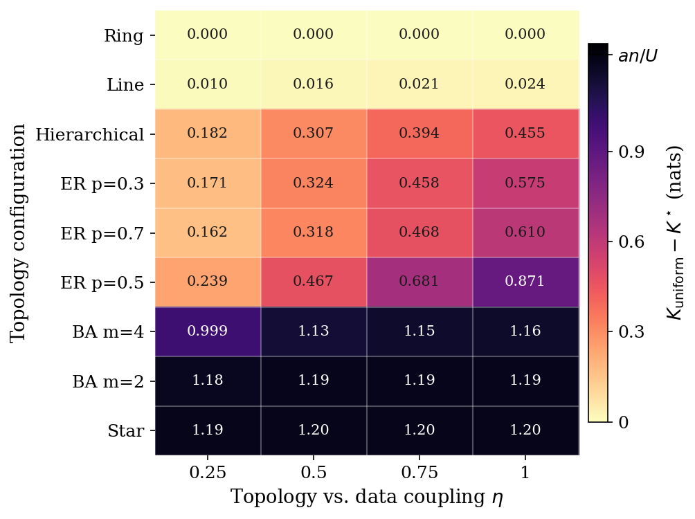

# Fulcrum

**Topology-aware differential privacy allocation for federated learning.**

Fulcrum is a research codebase for topology-conditional distributional
inference in differentially-private federated learning. It pairs a passive
attack (**TADI**) that quantifies what an adversary can recover about each
client's sensitive-class concentration with a defence (**Fulcrum**) that
allocates per-client DP-SGD noise asymmetrically across the federation,
giving every client the same worst-case mutual-information bound $K^\star$.

The name reflects the balance point: a lever where uneven privacy loads
find equilibrium under structural leverage.

<p align="center">
  
</p>

> *Topology-aware allocation strictly improves on uniform DP-SGD whenever
> structural leverage is non-uniform. Scale-free topologies (star, BA m=2)
> saturate within 2% of the analytic ceiling $an/U \approx 1.22$ nats;
> Erdős–Rényi graphs peak at $p = 0.5$ where binomial degree variance is
> maximised; symmetric topologies (ring, balanced hierarchies) reduce
> degenerately to uniform allocation. See
> [`docs/EMPIRICAL_RESULTS.md`](docs/EMPIRICAL_RESULTS.md) for the full
> empirical write-up.*

## Highlights

- **Per-client MI bound** that decomposes additively into a controllable
  mechanism term $T_{\max} C^2 / (2\sigma_i^2|B|^2)$ and an uncontrollable
  prior-coupling term $\ell_i^\circ$ (structural leverage).
- **Closed-form min-max optimal allocation**
  $\sigma_i^{*2} = a/(K^\star - \ell_i^\circ)$ with strict improvement over
  uniform DP-SGD when leverage is non-uniform; degenerate to uniform
  otherwise (so the defence can be adopted unconditionally).
- **Three leverage proxies** covering hierarchical FL (SBM group size),
  decentralised FL (graph degree), and cross-silo FL (FedAvg dataset-size
  influence).
- **TADI attack** with four channel ablations
  ($\mathcal{A}_1, \mathcal{A}_2^{\mathrm{topo}}, \mathcal{A}_2^{\mathrm{org}}, \mathcal{A}_2^{\mathrm{full}}$)
  operationalising the additive decomposition: the parameter channel is
  bounded by DP-SGD across all settings; the prior-coupling channels
  realise the bound under matched prior (perfect AUROC at η = 0.75 on
  Setting C) and are conservative under realistic public-proxy adversaries
  (no positive lift on Fed-Heart-Disease).
- **Empirical validation** on three federated benchmarks: Fed-ISIC2019
  (real cross-silo, hierarchical), Fed-Heart-Disease (real cross-silo,
  tabular), and CIFAR-10 with parametric η coupling (statistical vehicle),
  with nine topology configurations spanning the full leverage-asymmetry
  spectrum (ring, line, hierarchical, star, Erdős–Rényi at three densities,
  Barabási–Albert at two attachment values).

## Repository layout

```
Fulcrum/
├── docs/                        research design + empirical write-up
│   ├── EMPIRICAL_RESULTS.md     full empirical write-up by claim
│   ├── DEPLOYMENT.md            step-by-step VM deployment guide
│   ├── research_framing.md      what the paper claims and what it does not
│   ├── threat_model_partitioning.md
│   ├── attack_design.md         TADI architecture, features, regressors
│   ├── defense_design.md        Theorem 5.2 + Theorem 5.3 with full proofs
│   ├── references.md            primary-source verified citations
│   ├── decisions_log.md         chronological record of design commitments
│   └── figures/                 publication-grade PDF + PNG renders
├── fulcrum/                     the Python package
│   ├── data/                    Setting A/B/C data adapters
│   ├── topology/                line, hierarchical, ER, BA generators
│   │                            (Murmura ships ring/fully/erdos/k-regular)
│   ├── dp/                      leverage proxies + Theorem 5.3 allocation
│   │                            + Opacus per-client wrapper
│   ├── attacks/                 TADI: features, shadow training,
│   │                            regressors, metrics
│   ├── analysis/                Pareto frontier extraction, figure
│   │                            generation, utility-consistency tables
│   ├── models.py                per-setting model factories
│   │                            (Opacus-compatible)
│   ├── runner.py                end-to-end FL training with DP +
│   │                            feature collection
│   ├── storage.py               SQLite experiments DB + per-run NPZ/JSON
│   ├── config.py                dataclass-based YAML config schema
│   └── cli.py                   `fulcrum run|status|fit-tadi` commands
├── scripts/                     shell-callable wrappers
│   ├── setup_env.sh             venv + dependencies + FLamby from source
│   ├── download_data.py         CIFAR-10 + Fed-Heart-Disease auto;
│   │                            Fed-ISIC2019 manual instructions
│   ├── run_experiment.py        single-config runner
│   ├── run_factorial.py         sweep manager with hash-based skip
│   ├── analyze.py               Pareto + η-heatmap figures + Parquet
│   │                            exports (reads experiments.db)
│   ├── regen_figures_local.py   regenerate figures from parquet exports
│   │                            (no DB required)
│   └── run_attack_eval.py       TADI training + evaluation pipeline
├── configs/                     reference configs per setting
├── sweeps/                      factorial spec YAMLs
├── tests/                       standalone math verification
│                                (allocation, TADI metrics, topology,
│                                Pareto)
├── pyproject.toml               package definition
└── CODE_LAYOUT.md               developer-oriented layout reference
```

## Quick start

```bash
# Set up environment (uses uv)
bash scripts/setup_env.sh
source .venv/bin/activate

# Download datasets (CIFAR-10 + Fed-Heart-Disease auto; Fed-ISIC2019 manual)
python scripts/download_data.py

# Run one canonical experiment
python scripts/run_experiment.py configs/setting_b_canonical.yaml
fulcrum status

# Run a sweep
python scripts/run_factorial.py sweeps/eta_sweep_setting_c.yaml

# Generate the headline figures (from experiments.db)
python scripts/analyze.py eta-heatmap
python scripts/analyze.py pareto --setting C

# Regenerate figures locally from parquet exports (no DB required)
python scripts/regen_figures_local.py
```

For a step-by-step VM deployment guide — including CUDA verification, the
manual Fed-ISIC2019 download workflow, sweep ordering, monitoring,
recovery from interruptions, and what to send back for downstream
analysis — see [`docs/DEPLOYMENT.md`](docs/DEPLOYMENT.md).

## Reading the empirical results

The [`docs/EMPIRICAL_RESULTS.md`](docs/EMPIRICAL_RESULTS.md) report covers
every numerical finding from the experiments by claim, with full per-cell
detail and figure references. Headline takeaways:

| Claim | Evidence | Section |
|---|---|---|
| Topology-aware allocation strictly improves on uniform DP-SGD when leverage is non-uniform; degenerate otherwise | Privacy-bound gap up to **0.871** nats on ER (p=0.5) and **1.193** nats on BA (m=2), saturating the analytic asymptote | §4.1 |
| Improvement transfers across deployment regimes at every tested $(U, T_{\max})$ | Strict dominance at every Pareto cell on Settings A, B, C (relative gap up to **26.6%** on Fed-ISIC2019) | §4.2 |
| Privacy gain comes at no measurable utility cost | TOST equivalence ($p < 0.05$ at $\pm 0.5$ pp margin) on all three settings, all $T_{\max}$ values | §4.3 |
| The additive MI bound is empirically operational | Parameter channel bounded by DP-SGD on all settings; prior-coupling channels realise +0.076 lift and perfect AUROC at η=1 on Setting C; conservative under realistic public-proxy adversaries on Setting B | §4.4–§4.5 |

## Design references

Every design decision is documented in `docs/`. Notable entries:

- [`docs/research_framing.md`](docs/research_framing.md) — what the paper
  claims and what it deliberately does not.
- [`docs/threat_model_partitioning.md`](docs/threat_model_partitioning.md)
  — the formal adversary $\mathcal{A} = (\mathcal{K}, \mathcal{O}, \mathcal{I}, \mathcal{R})$,
  the three experimental settings, and the IID-null calibration.
- [`docs/defense_design.md`](docs/defense_design.md) — Theorem 5.2 +
  Theorem 5.3 statements and full proofs, plus the SBM-derived leverage
  corollary and the heuristic degree-based proxy.
- [`docs/decisions_log.md`](docs/decisions_log.md) — chronological record
  of every commitment, including two real math errors caught by
  adversarial self-review (multiplicative→additive bound correction; MI
  subadditivity misuse in the bounded-degree corollary).

## Citation

If you use this work, please cite:

```bibtex
@misc{rangwala2026fulcrum,
  title         = {Topology-Aware Differential Privacy in Federated Learning},
  author        = {Rangwala, Murtaza and Sinnott, Richard O. and Buyya, Rajkumar},
  year          = {2026},
  eprint        = {arXiv: TBD},
  archivePrefix = {arXiv},
  primaryClass  = {cs.LG},
}
```

## Authors

- **Murtaza Rangwala** ([@murtazahr](https://github.com/murtazahr)), University of Melbourne
- **Richard O. Sinnott**, University of Melbourne
- **Rajkumar Buyya**, University of Melbourne
